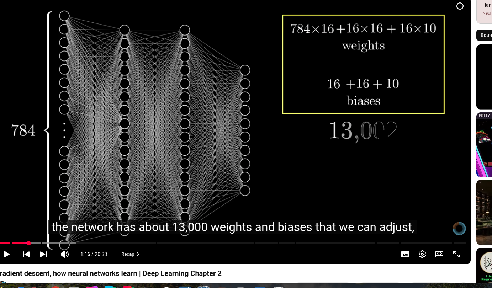

# Neural Networks
- https://www.3blue1brown.com/?topic=neural-networks
- http://neuralnetworksanddeeplearning.com/ - book by Michael Nielsen
  - https://github.com/mnielsen/neural-networks-and-deep-learning
- https://colah.github.io/
- https://distill.pub/

### Neuron - a "thing" that hold a number between 0.00...1.00 - The _ACTIVATION_.

- Each NN has inputs and outputs layers. 
- In the middle we can have a number of hidden layers.
- For every activation layer we assign a "weight". 
  - A weight is just a number - positive or negative. 
  - -X...0.00...X where -X can be between -1 or -100+ and X 1 or 100+
- To calculate a weight we use a function called Sigmoid. 
  Basically this is a measure of how positive the relevant weight sum is.
- Bias ia a number we want to feed in when we want the neuron the light up and activate on a specific condition.?
- Sigmoid is old school and most NN do not use it anymore. They switched to ReLU.
  - ReLU is = f(x) = max(0,x).
  - ReLU spits out 0 for any negative input, and doesn't change the positive inputs at all. Unlike sigmoid, the output of ReLU never flattens out, no matter how large the weighted sum becomes. So wiggling the weights always gives useful feedback about how the network should change.

#### Weights: 784×16 + 16×16 + 16×10

Every neuron in one layer connects to every neuron in the next, and each connection (each grey line) has its own weight. So the number of weights between two layers is the size of one layer times the size of the next:

Connection	Count
input → hidden 1	784 × 16 = 12,544
hidden 1 → hidden 2	16 × 16 = 256
hidden 2 → output	16 × 10 = 160
Total weights	12,960
Biases: 16 + 16 + 10

Each neuron that computes something gets one bias, a number added after the weighted sum: activation = σ(w·a + b). The 784 input neurons only hold pixel values and compute nothing, so they have no bias. That leaves 16 + 16 + 10 = 42 biases.

Total

12,960 + 42 = 13,002, which is the number the video is counting up to.

The general rule for any fully connected layer is weights = inputs × outputs and biases = outputs. You'll see the same formula in PyTorch: nn.Linear(784, 16) has 784×16 weights plus 16 biases.    
### Gradient Descent
