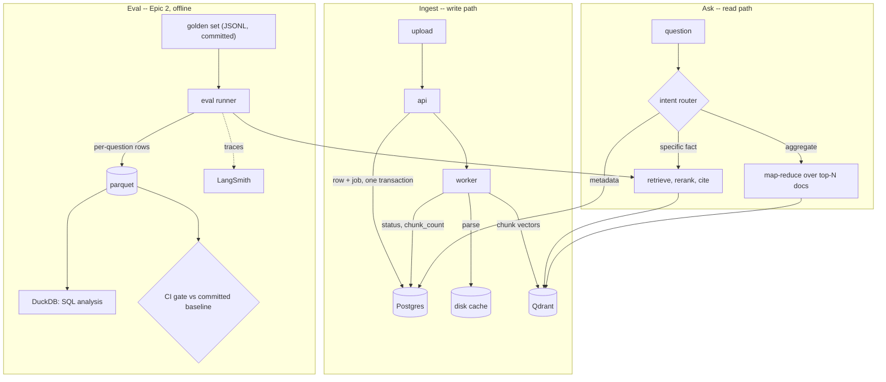

# Architecture: Global Agentic System Patterns Applied to This Project

This document surveys how production agentic systems are actually architected (as of mid-2026), then maps those patterns concretely onto this project. It exists because "build an agentic system" is easy to over- or under-engineer; the goal here is to justify every piece of agentic complexity against real production practice rather than either skipping it (a toy demo) or over-building it (an academic swarm nobody could operate).

## 1. Survey: What Production Agentic Systems Look Like in 2026

**Workflows vs. agents.** Anthropic's own guidance draws a hard line: *workflows* orchestrate LLMs and tools through predefined code paths — predictable, testable, cheap; *agents* let the LLM dynamically direct its own process and tool use — flexible, but more expensive and harder to test. The recommendation is to start with a workflow and only graduate to an agent when the task genuinely requires adaptive judgment. Six blueprint patterns cover most needs: prompt chaining, routing, parallelization, orchestrator-subagents, evaluator-optimizer, and fully autonomous agents. ([Anthropic — Building Effective Agents](https://www.anthropic.com/engineering/building-effective-agents))

**Multi-agent topology, by actual deployment share.** Three topologies show up in production: supervisor/hierarchical, orchestrator-worker, and swarm (peer agents, no central control). Orchestrator-worker — a hub that decomposes a goal, routes subtasks to specialist workers, and aggregates results, with workers never talking to each other — accounts for roughly 70% of real deployments. It wins not on elegance but on operability: it's the easiest topology to debug (one control-flow trace instead of an emergent mesh), and it avoids the cost/context blowups that show up once a system has more than a handful of workers (a workflow that costs $0.50 in testing can reach $50k/month at scale once orchestration overhead compounds across many worker calls). Swarm architectures dominate papers, not production. ([TrueFoundry — Multi-Agent Architecture](https://www.truefoundry.com/blog/multi-agent-architecture), [Beam.ai — Multi-Agent Orchestration Patterns for Production](https://beam.ai/agentic-insights/multi-agent-orchestration-patterns-production))

**LangGraph's supervisor pattern** implements exactly this: a supervisor node routes to specialist subagents via handoff tools, with shared state and an explicit termination condition. It's the recommended starting point over network/swarm patterns specifically because routing accuracy and debuggability matter more early on than the latency cost of an extra hop. ([LangGraph Supervisor reference](https://reference.langchain.com/python/langgraph-supervisor))

**Enterprise reference architecture layering** typically separates three concerns: an *Agent Layer* (reasoning plus tiered memory — short-term, working, long-term, episodic), a *Tool & API Layer* (standardized protocols connecting agents to systems), and a *Governance Layer* spanning both (guardrails, audit trails, compliance). Memory in particular is treated as a first-class architectural component, not an implementation detail. ([Rattix — Enterprise AI Agent Architecture Blueprint 2026](https://www.rattix.ca/blog/enterprise-ai-agent-architecture-blueprint-2026), [AaiNova — Enterprise Architecture Guide to Agentic AI Systems 2026](https://aainova.com/blogs/enterprise-architecture-guide-to-agentic-ai-systems-2026))

**MCP (Model Context Protocol)** has become the standard tool-layer protocol for connecting agents to tools and data — 10,000+ servers, adoption across every major lab — and is heading further toward enterprise-grade production readiness (OAuth 2.1, gateways, formal audit) through 2026. ([MCP anniversary post](https://blog.modelcontextprotocol.io/posts/2025-11-25-first-mcp-anniversary/))

**Security.** Prompt injection is the top attack vector against agentic systems, with reported success rates around 84% in tested agentic setups when no defense-in-depth is applied. The mitigation isn't a single filter but layered controls: input validation, context isolation (untrusted content never shares a message with instructions), output verification, tool-call validation, least-privilege tool scoping, and runtime monitoring.

**Evaluation.** Production agent evaluation scores full trajectories — tool-choice correctness, argument validity, step count, cost, policy compliance — not just the final answer. The operating principle: if you can't evaluate it, you can't ship it.

## 2. Applied Design in This Project

**Epic 1 stays a workflow, deliberately.** The `/ask` answer path (retrieve → rerank → generate with forced citations) is a fixed pipeline with no branching judgment calls — exactly the case where Anthropic's guidance says *don't* reach for an agent. This is a considered choice, not an omission: it keeps the highest-traffic path cheap, fast, and fully testable.

**Epic 3 is where real agency is needed — and it's scoped to orchestrator + two subagents, not a swarm:**

```
        ┌─────────────────────────── Orchestrator (deterministic StateGraph) ───────────────────────────┐
        │                                                                                                  │
 fetch_incoming → guard_content → parse_and_chunk → curate ──► evaluate ──► route ──► interrupt()/commit  │
        │            │                                 │           │                        │             │
        │      injection_guard.py                 Curator      Evaluator              only the            │
        │      (heuristic + Claude                 Agent        Agent                  orchestrator        │
        │       classification)                (proposes a   (independently          may call `commit`;   │
        │                                        verdict via   critiques the           subagents can only  │
        │                                        MCP tools,    verdict; disagree-      propose             │
        │                                        scoped read)  ment forces escalate)                       │
        └──────────────────────────────────────────────────────────────────────────────────────────────────┘
```

- **Orchestrator** (`app/agent/graph.py`) — the workflow half of the system: deterministic control flow, unchanged from a plain LangGraph `StateGraph`. It owns the `interrupt()`/`PostgresSaver` HITL gate and is the *only* place the `commit` tool is reachable.
- **Curator Agent** (`app/agent/subagents/curator.py`) — reasons over the new item against the existing KB (via `mcp_server` tools: `kb_query`, `contradiction_check`) and against `episodic_memory.py` (has something like this been decided before?), producing a confidence verdict + rationale.
- **Evaluator Agent** (`app/agent/subagents/evaluator.py`) — the evaluator-optimizer pattern: an independent second pass that critiques the Curator's verdict rather than rubber-stamping it. Disagreement between the two forces escalation even if one side reports high confidence — this is the concrete mechanism that makes "human-in-the-loop" mean something more than "one model's confidence score."

**Why two subagents and not a swarm:** matches the ~70%-of-production orchestrator-worker pattern; keeps the system debuggable as a single traceable path through the Reasoning Trace UI; keeps cost bounded (2 extra LLM calls per curation decision, not N).

**Tool layer:** subagents don't get raw Python function bindings — they get MCP clients scoped to only the tools their role needs (`mcp_server/tools.py`: `kb_query`, `contradiction_check`, `review_queue`). Neither subagent's scope includes `commit`. This is the least-privilege control, enforced at the tool-access layer rather than by prompt instruction alone.

**Memory tiers**, made explicit rather than implicit:
| Tier | What | Where |
|---|---|---|
| Short-term | Current run's state | LangGraph `StateGraph` state, checkpointed via `PostgresSaver` |
| Long-term | The knowledge base itself | Epic 1's Qdrant collection (Epic 3 imports it directly — no second store) |
| Episodic | Past human curation decisions + rationale | `app/agent/episodic_memory.py` (sqlmodel), consulted by the Curator so settled judgment calls aren't re-litigated every run |

**Defense-in-depth against prompt injection** (scraped web content is the untrusted-input surface here):
1. Context isolation — scraped text is always passed as inert `document`-typed content, never concatenated into system/tool instructions.
2. `injection_guard.py` — heuristic + Claude classification pass, run before any agent sees the content.
3. Tool-call validation — subagents structurally cannot call `commit`; only the orchestrator can, after the interrupt gate resolves.
4. Least-privilege MCP scoping — each subagent's tool access is scoped narrowly to its role.
5. Runtime monitoring — LangSmith traces every LangChain/LangGraph step, including subagent tool calls (Epic 4; supersedes the originally-planned Arize Phoenix — see `README.md`'s Observability row).

No single layer above is assumed sufficient on its own — that assumption is exactly what an 84%-success-rate attack vector exploits.

**Full-trajectory evaluation:** `eval/agent_trace_assertions.py` asserts not just the escalate/don't-escalate binary but tool-choice correctness (did each subagent only call tools within its scope?) and step count/cost per run, run as a CI regression suite alongside the RAGAS answer-quality gate.

## 2b. Where each kind of data lives

Three stores exist today and a fourth arrives with Epic 2. They are not
interchangeable, and the boundary is about *how the data behaves*, not what it
describes.

| Store | Holds | Shape | Rebuildable from |
|---|---|---|---|
| **Postgres** | tenants, API keys, document rows, job queue, (Epic 3) episodic memory + incoming queue | mutable, transactional, row-at-a-time reads | nothing — this is the system of record |
| **Qdrant** | one point per chunk: vector + payload metadata | write-once per ingest, similarity reads | yes — re-ingest the documents |
| **Disk** (`processed_dir`) | parsed Docling JSON, extracted figure PNGs | write-once cache | yes — re-parse the source file |
| **Parquet** *(Epic 2)* | eval run output: one row per question x retrieved chunk | append-only, never updated, read in aggregate | yes — re-run the eval |

The distinction that matters: **Postgres holds state that changes; parquet holds
measurements that accumulate.** A document row goes `pending -> processing ->
ingested` and is read by key on every status poll — that is Postgres. An eval run
emits thousands of rows that are never touched again and are only ever read as
`GROUP BY`/percentile aggregates — that is columnar.

Eval output is deliberately **not** user data and does not belong in the
operational database:

- Each new metric would be an `ALTER TABLE` plus a migration, on the same database
  serving live requests. In parquet a new metric is a new column in new files, and
  DuckDB unions old and new files with `NULL`s.
- **CI needs a committed baseline to compare against.** A retrieval-quality gate
  reads "last known-good scores" from somewhere version-controlled, so a regression
  shows up as a reviewable diff in the pull request. A Postgres row cannot be
  `git diff`ed; a baseline file can.
- Analysis wants SQL without a service. DuckDB reads
  `SELECT ... FROM 'data/eval/runs/*.parquet'` directly — no table, no migration,
  no connection pool.

LangSmith still holds traces and hosted experiment comparison, and that overlap is
intentional rather than redundant: LangSmith is for *exploring* a run interactively,
the parquet baseline is for *gating* one offline and in version control. Neither
replaces the other, and the CI gate must not depend on a network call to a hosted
service.



The intent router in the read path does not exist yet; it is Epic 2's first item
and the general fix for a defect already observed in production (a metadata
question -- "list my documents" -- answered from whatever chunks were nearest in
embedding space). See `EPIC_2_PLAN.md`.

## 3. What This Deliberately Does Not Do

- No swarm / peer-to-peer agent mesh — the production data doesn't support it as a starting point, and it would make the Reasoning Trace UI (an explicit acceptance criterion) far harder to build meaningfully.
- No agentic rewrite of Epic 1 — the answer path has no branching judgment call to hand to an LLM; making it "agentic" would only add cost and non-determinism for no benefit.
- No general-purpose autonomous agent with an unbounded tool list — every tool a subagent can reach is enumerated and scoped in `mcp_server/tools.py`; there is no default-allow tool surface.

## Sources

- [Anthropic — Building Effective Agents](https://www.anthropic.com/engineering/building-effective-agents)
- [TrueFoundry — Multi Agent Architecture: Patterns, Use Cases & Production Reality](https://www.truefoundry.com/blog/multi-agent-architecture)
- [Beam.ai — 6 Multi-Agent Orchestration Patterns for Production (2026)](https://beam.ai/agentic-insights/multi-agent-orchestration-patterns-production)
- [LangGraph Multi-Agent Supervisor reference](https://reference.langchain.com/python/langgraph-supervisor)
- [Rattix — Enterprise AI Agent Architecture Blueprint (2026)](https://www.rattix.ca/blog/enterprise-ai-agent-architecture-blueprint-2026)
- [AaiNova — Enterprise Architecture Guide to Agentic AI Systems (2026)](https://aainova.com/blogs/enterprise-architecture-guide-to-agentic-ai-systems-2026)
- [Model Context Protocol — One Year Anniversary / 2026 roadmap](https://blog.modelcontextprotocol.io/posts/2025-11-25-first-mcp-anniversary/)
